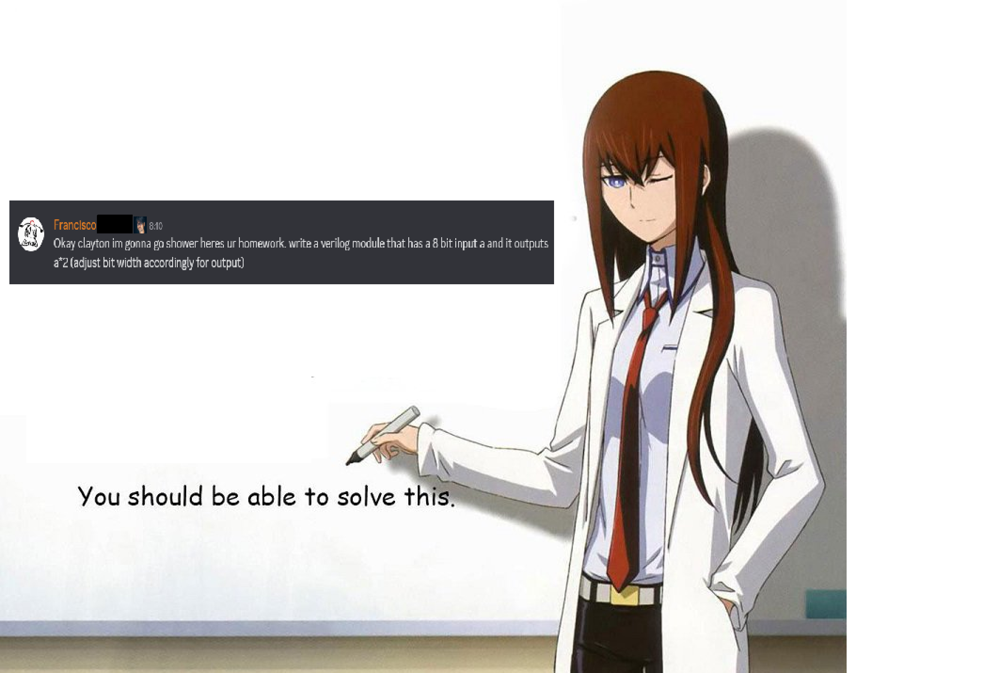

francisco said i have to do his assignments, idk what any of this is,

## resources

- [verilog 2005 reference](https://www.eg.bucknell.edu/~csci320/2016-fall/wp-content/uploads/2015/08/verilog-std-1364-2005.pdf)
- [icarus verilog](https://steveicarus.github.io/iverilog/) (compiler & runtime)
- [surfer](https://surfer-project.org/) (waveform viewer)

## assignments

- [assignment 1](01): multiply input by 2
- [assignment 2](02): clock signal
- [assignment 3](03): case statement
